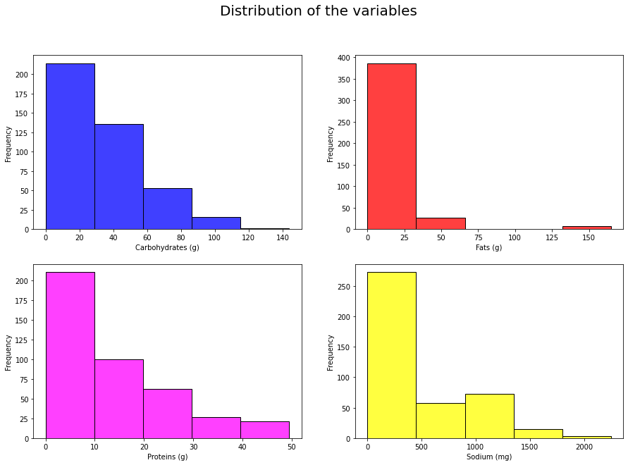

# Calories prediction
This is a project of the *Maths and Data Science for Decision Making* course. 

It retrieves the consumption of calories by the macronutrients and sodium consumed by the user (me) and make a multiple linear regression model to predct the consumption of calories with the variables that have the most correlation with the consumption of calories (*Carbohydrates, Protein, Fat, Sodium*).

In this process, the nan data are removed, the data is normalized and the data is split into train and test sets.

Here are the histograms of the variables:

This project is programmed in:
- Python 3.8
- Using Jupyter Notebook
